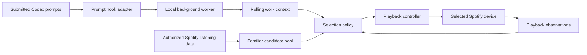

# Implementation plan

## Scope

Deliver a personal, local-first prototype that quietly adapts familiar music while the listener uses Codex. First prove prompt capture and playback behavior, then evaluate whether the selections feel right. This repository currently contains planning only; language, model, packaging, and hosting choices remain open.

## Components

The prompt adapter should enqueue bounded events and return promptly. Classification and network calls belong in the worker, independent of the coding turn. A music-service failure must not block a prompt.

Use event IDs for deduplication, a short context window, bounded storage, and a single playback owner. If multiple Codex tasks are active, start with one opted-in session rather than allowing competing controllers.

## Selection behavior

- Establish familiarity from actual listening evidence. Do not invent musical preferences.
- Rank for familiarity, work-context fit, and continuity; exact weights are experimental.
- Track-level mood or energy labels require a validated data source or explicit heuristic. Do not assume genre or artist identity reliably describes every song.
- Apply repetition limits and minimum time between direction changes. Keep the current direction when evidence is weak.
- Prefer natural track boundaries. Do not promise seamless crossfades, unrestricted queue editing, or precise timing until the client/API behavior is demonstrated.
- Treat skips as ambiguous feedback. Distinguish companion-selected plays from independent listening where possible so the system does not reinforce its own choices as new evidence of taste.
- Yield to manual pause, track selection, device changes, and playback controlled elsewhere. Define and test how manual intervention is detected.

## Milestones

### 1. Integration feasibility

- Verify `UserPromptSubmit` from the target Codex desktop build, including ordinary typed and submitted voice input if supported.
- Demonstrate that capture returns promptly and worker failures cannot stall Codex.
- Authenticate a Spotify development app and read back its authorized account and selected playback device.
- Verify access to top tracks, recent plays, and any proposed library/playlist endpoints.
- Demonstrate controlled playback with explicit test activation; record queue, boundary timing, and manual-control limitations.
- Review current provider terms for the proposed personalization and model usage before processing Spotify-derived data with a model.

**Exit evidence:** a concise record of observed behavior, API access, and unresolved limitations. If hooks are unavailable, investigate supported app-server events; transcript-file watching is only a fallback with format/version risks documented.

### 2. Observe-only prototype

- Generate candidate selections from real authorized preference data without changing playback.
- Use synthetic prompts for development; do not commit private conversations or listening histories.
- Compare sustained context changes with trivial edits and ambiguous prompts.
- Inspect proposed selections for familiarity, repetition, continuity, and unsupported assumptions.

**Exit evidence:** reviewed examples show familiar selections and stable behavior across minor prompt changes. Mood-label quality and candidate coverage are documented rather than assumed.

### 3. Automatic personal pilot

- Enable autonomous selection after one-time setup and explicit pilot activation.
- Make gradual changes around track boundaries without per-track prompts or chat announcements.
- Verify pause/manual-selection precedence, duplicate events, multiple sessions, restarts, expired authorization, rate limits, unavailable devices, and offline recovery.
- Avoid replaying stale decisions when reconnecting.

**Exit evidence:** an observed listening session demonstrates automatic adaptation, preserved manual control, and safe recovery. The listener judges musical fit; successful API calls alone do not establish quality.

### 4. Packaging and expansion

Select the runtime and operating-system integration after the pilot. For NixOS, use declarative configuration for persistent services. Investigate Apple Music, broader distribution, provider access requirements, and licensing separately.

## Data boundaries

- Observe submitted prompts only, from opted-in sessions. No keylogging or broad desktop monitoring.
- Keep raw prompt content local by default and short-lived. Any remote classifier requires an explicit data-flow decision during setup.
- Send only playback identifiers and necessary control data to the music provider.
- Keep OAuth credentials in an appropriate local credential store; never in source control or debug output.
- Separate integration data from public sample fixtures. Avoid logging raw prompts, listening history, and tokens.
- Include a simple off switch. On uncertainty or errors, preserve existing playback.

## Decisions still needed

- Runtime and service packaging.
- Supported Codex desktop versions and hook behavior.
- Local classifier versus opt-in remote classification.
- Source and quality of musical attributes used for contextual matching.
- Familiar-only default versus an optional amount of discovery.
- Track-boundary scheduling and intervention detection supported by Spotify.
- Multi-session ownership and automatic resumption after a manual override.
- Distribution and license choice. Public visibility alone is not an open-source license.

## First collaboration pass

Review the experience in the README, challenge assumptions in milestone 1, and agree on a narrow integration spike. Record observations and decisions through issues or pull requests before committing to the implementation stack.
